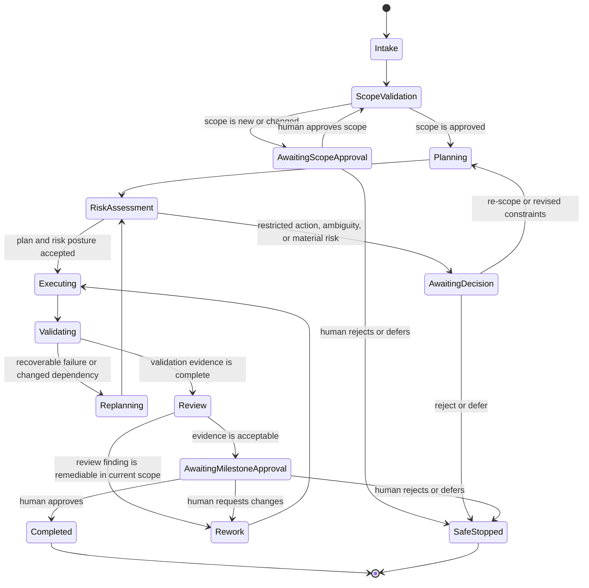
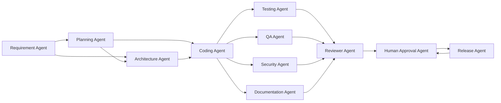
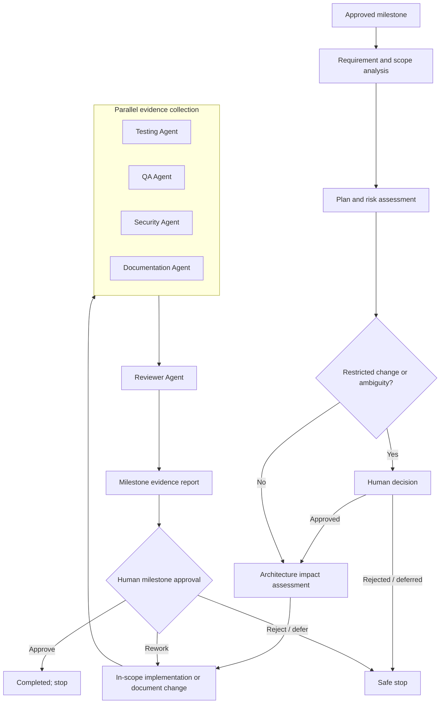
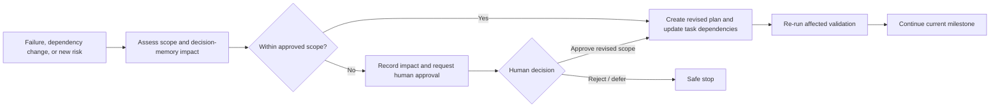
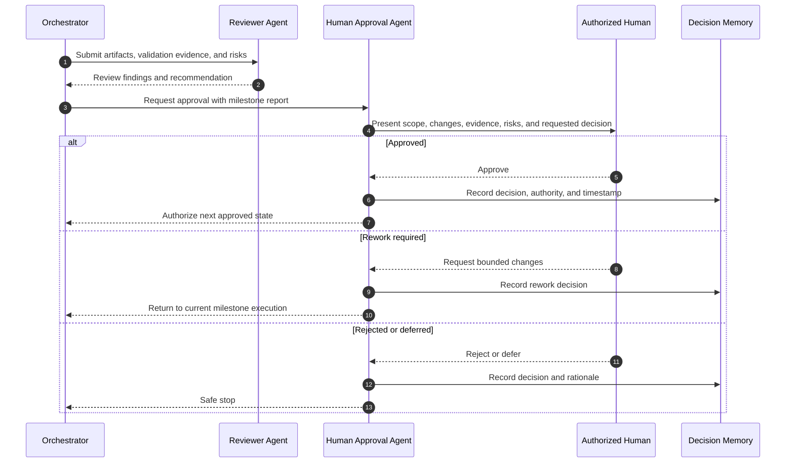

# Agentic SDLC Orchestrator Design

## 1. Purpose

The Agentic SDLC Orchestrator governs engineering delivery for the URL Shortener platform. It converts an explicitly approved milestone request into bounded work, coordinates specialized agents, collects validation evidence, evaluates risk, and stops for human approval at every milestone boundary.

The orchestrator is not a release authority. It cannot silently broaden scope, approve its own work, publish a release, deploy, change shared infrastructure, or apply shared or production data changes without the designated human approval.

## 2. Design Principles

- **Bounded autonomy:** agents act only within the approved milestone scope and allowed artifact set.
- **Evidence before progression:** no state advances without the evidence defined for its gate.
- **Human authority:** a human approval is mandatory for milestone transition and restricted actions.
- **Least privilege:** each agent receives only the context and authority necessary for its task.
- **Deterministic records:** decisions, inputs, artifacts, validation results, and approval outcomes are retained in an auditable form.
- **Safe degradation:** uncertainty, unavailable dependencies, conflicting evidence, or policy violations cause a safe stop or escalation, never silent continuation.
- **Traceability:** every artifact and validation result is linked to requirements, milestone, and review outcome.

## 3. Agent Definitions

| Agent | Primary Responsibility | Inputs | Outputs | May Act Autonomously | Requires Human Approval |
| --- | --- | --- | --- | --- | --- |
| Requirement Agent | Extracts, normalizes, and traces business and functional requirements. | Product request, BRD, FRD, prior decisions. | Requirement inventory, ambiguities, acceptance criteria, trace links. | Read and analyze approved sources. | Resolving material ambiguity or changing accepted requirement baseline. |
| Planning Agent | Decomposes an approved objective into bounded tasks, dependencies, risks, and validation gates. | Requirement inventory, architecture, milestone request. | Execution plan, dependency graph, risk register, approval points. | Create plan within scope. | Scope expansion, new milestone, or altered priority. |
| Architecture Agent | Assesses design impacts and produces architecture decisions and diagrams. | Requirements, constraints, existing architecture. | Architecture proposals, ADR candidates, impact analysis. | Analyze and document within architecture milestone. | Any architecture decision that affects approved contracts, data, security, or operations. |
| Coding Agent | Implements approved changes in the allowed repository paths. | Approved plan, architecture, coding standards, task context. | Source changes, configuration changes, implementation notes. | Make in-scope local changes. | Public API, schema, security, external-infrastructure, or deployment changes. |
| Testing Agent | Designs and executes automated validation appropriate to the change. | Requirements, changed artifacts, test strategy. | Test cases, results, coverage evidence, failure reports. | Run non-destructive tests and add in-scope tests. | Changing acceptance criteria or accepting a known test failure. |
| QA Agent | Independently assesses functional behavior, negative cases, regression risk, and release readiness. | Requirements, implementation evidence, test results. | QA assessment, defect report, acceptance recommendation. | Analyze and report. | Accepting unresolved critical or high-severity defect risk. |
| Security Agent | Evaluates authentication, authorization, input validation, secrets, privacy, and abuse risks. | Architecture, changes, threat assumptions, policies. | Security findings, control recommendations, risk acceptance request. | Analyze and report. | Security-policy changes, risk acceptance, or changes to protected controls. |
| Documentation Agent | Maintains user, API, operational, and engineering documentation. | Approved behavior, validation results, architecture decisions. | Documentation changes and traceability updates. | Edit in-scope documentation. | Publishing externally or changing an approved public contract. |
| Release Agent | Assembles release evidence and verifies delivery readiness. | Version, CI results, QA/security assessments, release policy. | Release candidate report, release notes, rollback readiness assessment. | Prepare evidence only. | Tagging, publishing, deploying, or promoting a release. |
| Reviewer Agent | Checks completeness, consistency, maintainability, and policy alignment independently of the producing agent. | Proposed artifacts, requirements, validation evidence. | Review findings and recommendation. | Analyze and report. | Overriding unresolved critical findings. |
| Human Approval Agent | Represents the explicit, recorded decision of an authorized human. | Milestone report, risks, evidence, approval request. | Approve, reject, defer, or re-scope decision. | Never; it records human authority only. | Every milestone transition and all restricted actions. |

## 4. Orchestrator State Machine

## 5. Dependency Graph

The dependency graph prevents agents from consuming unapproved or unvalidated outputs.

## 6. Execution Graph and Parallel Execution

Parallel execution is permitted only when tasks have no write conflict and one task’s acceptance does not depend on an uncompleted output from another task. The coordinator serializes conflicting artifact changes, contract decisions, schema decisions, and release actions.

## 7. Task Contract and Context Store

Every agent task has an immutable task contract and a scoped context bundle.

| Contract Field | Purpose |
| --- | --- |
| Milestone identifier | Connects work to one approved phase and proposed commit. |
| Objective | States the desired outcome in testable terms. |
| Allowed artifacts | Lists files, systems, and operations the agent may affect. |
| Explicit exclusions | Prevents implied work outside the milestone. |
| Inputs | Identifies authoritative requirements, decisions, artifacts, and prior evidence. |
| Acceptance evidence | Defines the checks, review findings, or artifacts needed to complete work. |
| Risk constraints | Lists policies, dependencies, or actions that require escalation. |
| Authority level | Read-only, in-scope change, validation-only, or human-decision required. |

The context store is a versioned, access-controlled record containing the approved BRD, FRD, architecture documents, accepted decisions, task contracts, artifact hashes or references, test results, review findings, risk register, and approval records. Agents receive a minimum necessary context view. They must treat approved records as authoritative and flag contradictions rather than overwrite them.

## 8. Decision Memory

Decision memory preserves durable decisions across milestones and avoids repeated or inconsistent reasoning.

| Record | Required Content |
| --- | --- |
| Decision ID | Stable identifier and date. |
| Decision statement | What was decided, with unambiguous scope. |
| Rationale | Why the decision was made, including alternatives considered. |
| Authority | Human approver or approved governing document. |
| Affected artifacts | Requirements, design, code, tests, operations, or release assets affected. |
| Constraints | Non-negotiable implications for future work. |
| Review trigger | Event that requires revisiting the decision. |
| Supersession | Link to a later approved decision, if any. |

Agents may propose a new decision record but cannot amend an accepted decision without routing it through the applicable human approval gate.

## 9. Retry, Rollback, Fallback, and Safe Stop

### 9.1 Retry Strategy

| Situation | Retry Behavior | Escalation Rule |
| --- | --- | --- |
| Transient read-only tool or dependency failure | Bounded retry with exponential backoff and jitter. | Escalate after the approved retry budget is exhausted. |
| Deterministic validation failure | Do not repeat unchanged validation blindly; analyze and replan. | Escalate if the fix exceeds current scope. |
| Concurrent artifact conflict | Refresh context, re-evaluate ownership, and serialize the conflicting work. | Escalate if conflict changes accepted behavior. |
| CI infrastructure failure | Retry once when evidence indicates an external transient failure. | Escalate when result remains inconclusive. |
| Security or policy violation | No autonomous retry that alters policy. | Immediate safe stop and human escalation. |

### 9.2 Rollback Strategy

The orchestrator uses small, milestone-bounded commits and evidence records. If an in-scope change fails validation, the Coding Agent reverts only its identified uncommitted or milestone-local modifications after confirming the exact target. If changes have been committed or shared, rollback requires a reviewed corrective commit and relevant human approval. Database, infrastructure, security, and production changes follow the architecture rollback strategy and are never autonomously reversed in shared environments.

### 9.3 Fallback Strategy

| Primary Path Unavailable | Safe Fallback |
| --- | --- |
| Specialized agent unavailable | Use the coordinator for limited analysis or defer work; never claim specialist validation was completed. |
| External validation unavailable | Record incomplete evidence and request a human decision; do not mark milestone complete. |
| Context source unavailable | Use only approved cached records with provenance; otherwise pause. |
| Ambiguous requirement | Produce explicit questions and wait for product-owner or approver direction. |
| Conflicting evidence | Prefer the authoritative approved record, record the conflict, and escalate. |

### 9.4 Safe Stop Conditions

The orchestrator transitions to `SafeStopped` when scope is missing or revoked; a restricted action lacks approval; inputs are materially ambiguous; context integrity is uncertain; policy or security risk is detected; validation evidence is incomplete; a human rejects or defers the milestone; or the agent cannot make safe, meaningful progress. A safe stop preserves all collected evidence, identifies the exact blocking condition, and asks for the smallest decision needed to resume.

## 10. Dynamic Replanning

Dynamic replanning is allowed only inside the current approved objective. The Planning Agent must create a revised plan when validation reveals a previously unknown dependency, a task fails for a non-trivial reason, an artifact conflict appears, an accepted assumption is invalidated, or a newly identified risk changes the task order.

Replanning cannot reduce acceptance evidence, bypass review, or convert a restricted action into an autonomous action.

## 11. Human Approval Workflow

An approval request must include the milestone objective, artifact list, requirements traceability, validation results, unresolved findings, risks and mitigations, rollback implications when applicable, and the exact decision requested. Approval is explicit, time-stamped, tied to a specific artifact set, and invalidated if material scope or artifact changes occur afterward.

## 12. Audit Trail

The audit trail is append-only and correlates every material orchestration action.

| Event Category | Required Fields |
| --- | --- |
| Intake | Requester, requested objective, milestone, received time, source references. |
| Scope | Task contract, included and excluded artifacts, authority level, scope decision. |
| Planning | Task graph, dependencies, risk assessment, planned validation. |
| Execution | Agent identity, action category, artifact references, before/after hashes where applicable, result. |
| Validation | Validator identity, command or check category, environment reference, outcome, evidence location. |
| Review | Reviewer identity, findings, severity, disposition, recommendation. |
| Approval | Approver identity, decision, timestamp, artifact baseline, rationale, conditions. |
| Replan / rollback | Trigger, changed plan, affected artifacts, safety assessment, result. |
| Stop | Stop reason, unresolved blocker, preservation location, required next decision. |

Audit records are protected from unauthorized alteration. Retention, storage location, and access policy must satisfy organizational security and compliance requirements.

## 13. Reliability Metrics

| Metric | Definition | Purpose |
| --- | --- | --- |
| Milestone completion rate | Approved completed milestones divided by started milestones. | Measures delivery flow reliability. |
| First-pass validation rate | Milestones passing required validation without rework divided by validated milestones. | Identifies planning and implementation quality. |
| Approval reversal rate | Approved milestones later reopened or reverted divided by approved milestones. | Detects weak evidence or review quality. |
| Scope-change rate | Milestones requiring re-scope divided by started milestones. | Measures requirement and planning stability. |
| Safe-stop correctness | Safe stops with confirmed valid escalation divided by all safe stops. | Measures governance sensitivity. |
| Evidence completeness rate | Milestones with all required evidence divided by submitted milestones. | Enforces controlled progression. |
| Agent retry exhaustion rate | Tasks exhausting retry budget divided by retried tasks. | Reveals unstable tools or invalid recovery assumptions. |
| Review finding escape rate | Material post-approval findings divided by approved milestones. | Measures review effectiveness. |
| Traceability coverage | Accepted requirements linked to design, implementation, and validation evidence. | Measures verification completeness. |
| Unauthorized-action count | Actions attempted outside task authority. Target: zero. | Measures governance effectiveness. |

## 14. Governance Rules

1. Every milestone requires a human-approved task contract before execution.
2. An agent may not create work outside the allowed artifact set or authority level.
3. A requirement, public contract, architecture, security, privacy, data, infrastructure, release, or deployment decision cannot be silently changed by an agent.
4. Independent review is required before presenting a milestone for approval when the milestone changes implementation, interfaces, security, data, or operations.
5. Validation evidence must be reproducible or explicitly marked as unavailable with cause and impact.
6. Failing, skipped, or inconclusive validation cannot be represented as passing.
7. The orchestrator must stop after each milestone and wait for explicit approval.
8. The orchestrator must preserve unrelated user changes and never use destructive rollback actions without clear authority and verified targets.
9. Agents must not expose secrets, credentials, private context, or unapproved personal data in reports, logs, or artifacts.
10. Any conflict between an agent recommendation and an approved human decision is resolved in favor of the human decision until formally revised.
11. The Human Approval Agent records decisions but does not simulate or infer human authorization.
12. Governance records and decision memory are mandatory inputs to future planning and review.

## 15. Traceability to Platform Architecture

| Platform Architecture Need | Orchestrator Control |
| --- | --- |
| Milestone-based delivery | Task contract, state machine, and mandatory milestone approval. |
| Requirements traceability | Requirement Agent, context store, decision memory, and audit trail. |
| Safe implementation | Least-privilege Coding Agent, Reviewer Agent, and validation gate. |
| Security and privacy | Security Agent, protected context, restricted-action gate, and audit evidence. |
| Testing and QA | Separate Testing and QA Agents with independent evidence and review. |
| Release safety | Release Agent prepares evidence only; human authority controls publication and deployment. |
| Operational resilience | Retry, fallback, safe stop, rollback, and reliability metrics. |

---

## Orchestration Design Approval Checkpoint

Approval of this document establishes the governed orchestration model for future approved milestones. It does not authorize implementation, release, deployment, external integration, or changes to platform security, data, or infrastructure.
