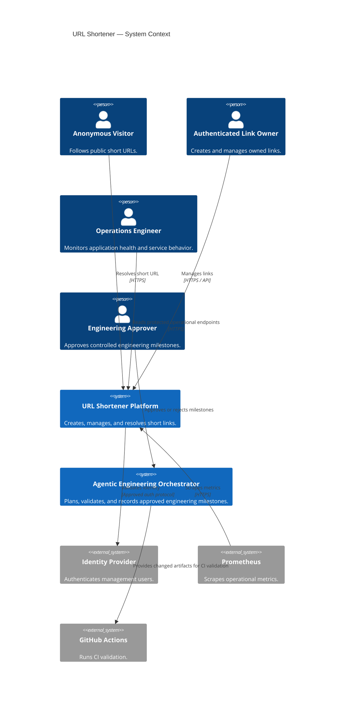
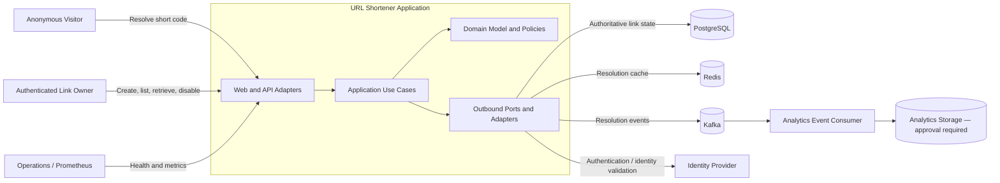
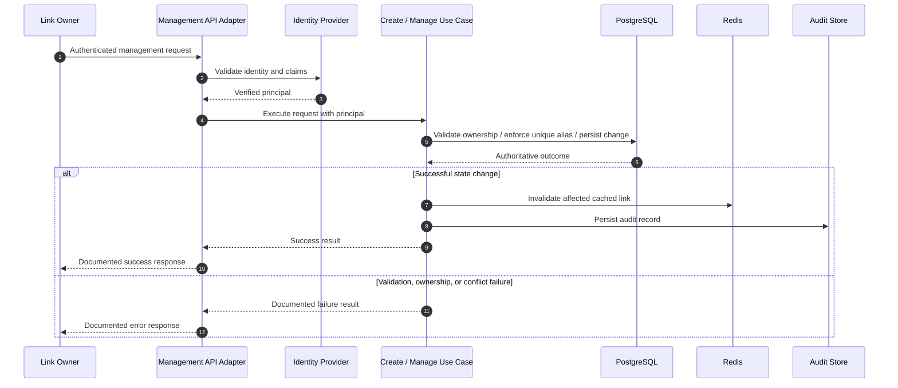
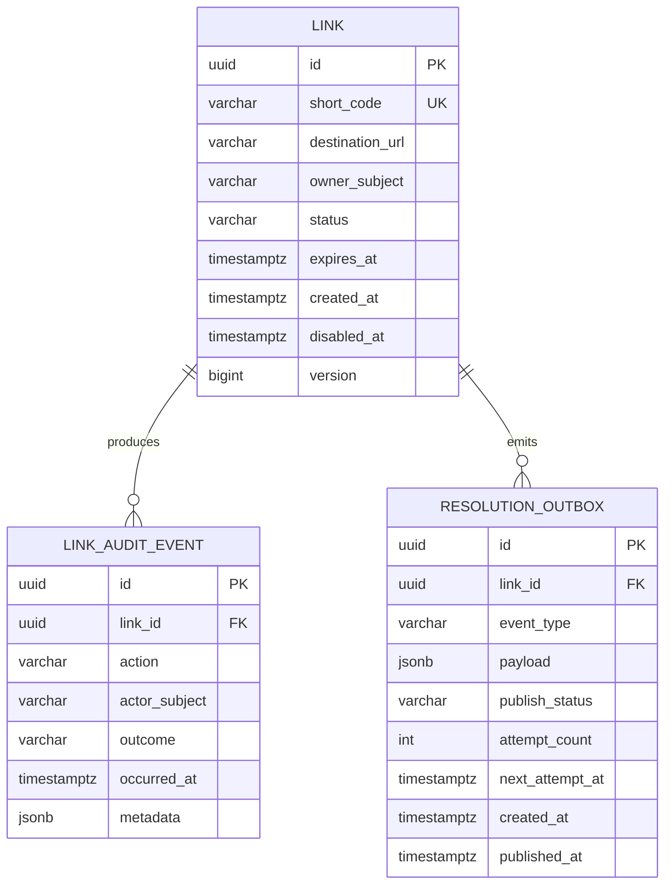
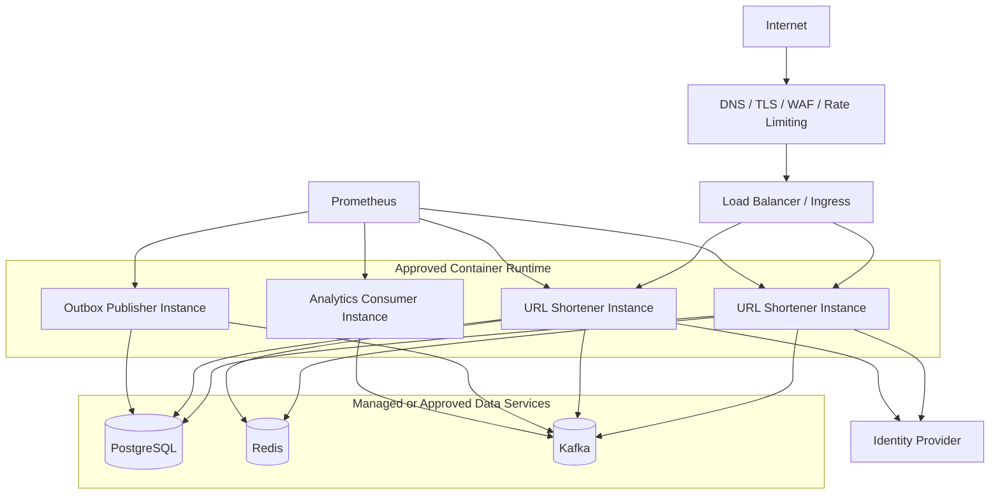
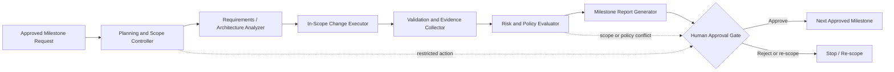

# System Architecture

## 1. Architecture Goals and Constraints

The URL Shortener is a production-oriented, stateless Spring Boot service that prioritizes correct, low-latency redirect resolution. PostgreSQL is the authoritative source for link state. Redis accelerates read resolution but must never be the sole source of truth. Kafka carries asynchronous resolution events; neither Kafka publication nor consumption is on the critical redirect path.

The architecture implements the BRD and FRD requirements using Clean Architecture boundaries and domain-oriented language. It supports controlled engineering automation: every milestone is bounded, evidenced, and approved by a human before the next milestone begins.

## 2. System Context



## 3. Logical Component Architecture



### 3.1 Component Responsibilities

| Component | Responsibility | Dependency Rule |
| --- | --- | --- |
| Web and API adapters | Translate HTTP requests and responses, apply boundary validation, map errors, expose public redirects and protected management APIs. | Depends on application ports only. |
| Application use cases | Coordinate create, resolve, list, retrieve, disable, and event-publication workflows. | Depends on domain model and interfaces, not infrastructure implementations. |
| Domain model and policies | Enforce link lifecycle, eligibility, alias policy contracts, and ownership rules. | Has no framework, database, cache, or messaging dependency. |
| Persistence adapter | Implements authoritative link and audit storage. | Depends on PostgreSQL integration only. |
| Cache adapter | Reads and invalidates cache entries; never authorizes a stale or unverified state change. | Depends on Redis integration only. |
| Messaging adapter | Publishes resolution events and provides reliable publication behavior. | Depends on Kafka integration only. |
| Analytics consumer | Processes resolution events independently from redirects. | Does not participate in redirect response handling. |
| Observability adapter | Supplies structured logs, metrics, tracing context, and health contributions. | Cross-cutting; must not expose secrets or unnecessary personal data. |

## 4. Redirect Resolution Sequence

```mermaid
sequenceDiagram
    autonumber
    participant Visitor
    participant API as Redirect Adapter
    participant UseCase as Resolve Link Use Case
    participant Redis
    participant PostgreSQL
    participant Kafka

    Visitor->>API: GET /{shortCode}
    API->>UseCase: resolve(shortCode)
    UseCase->>Redis: Read cached link state
    alt Cache hit and entry is eligible
        Redis-->>UseCase: Link state
    else Cache miss, cache unavailable, or entry requires verification
        UseCase->>PostgreSQL: Read authoritative link state
        PostgreSQL-->>UseCase: Link state / absent
        opt Active and unexpired link
            UseCase->>Redis: Populate or refresh cache
        end
    end
    alt Link is active and unexpired
        UseCase-->>API: Destination URL
        API-->>Visitor: Approved redirect response
        UseCase-)Kafka: Publish resolution event asynchronously
        Note over UseCase,Kafka: Publication failure is observed; redirect is unaffected.
    else Link missing, disabled, or expired
        UseCase-->>API: Non-resolution result
        API-->>Visitor: Documented non-resolution response
    end
```

## 5. Link Management Sequence



## 6. Database Design

PostgreSQL is the authoritative transactional store. All state-changing link operations are transactional. Database constraints enforce invariants that cannot rely solely on application checks.



### 6.1 Table Responsibilities and Constraints

| Table | Responsibility | Required Constraints and Indexes |
| --- | --- | --- |
| `link` | Stores authoritative link state. | Primary key on `id`; unique constraint on `short_code`; index on `owner_subject` with creation ordering for owner listing; check constraint for valid status; index on `expires_at` for lifecycle operations. |
| `link_audit_event` | Stores immutable, business-relevant management audit records. | Primary key on `id`; foreign key to `link`; index on `link_id, occurred_at`; index on `actor_subject, occurred_at`; append-only access policy. |
| `resolution_outbox` | Stores resolution events transactionally before asynchronous Kafka publication. | Primary key on `id`; foreign key to `link`; index on `publish_status, next_attempt_at`; idempotency key or unique event identity. |

### 6.2 Data Rules

- `short_code` is unique in the public namespace and uses a case policy approved during API and security design.
- `status` is `ACTIVE` or `DISABLED`; expiration is represented separately by `expires_at` and assessed against a consistent application clock.
- An active link with a past `expires_at` is non-redirectable even if no background process has updated a materialized status.
- `destination_url` is persisted only after successful policy validation.
- `owner_subject` stores the stable subject from the approved identity provider, not a client-supplied identity field.
- Link modification and disablement use optimistic concurrency (`version`) to prevent lost updates.
- Audit records and outbox records are committed in the same transaction as their associated state change or resolution decision where applicable.

## 7. Redis Design

Redis is a disposable performance layer for redirect resolution.

| Topic | Design |
| --- | --- |
| Key | `url-shortener:link:{shortCode}` with an approved namespace version prefix. |
| Value | A compact serialized representation of the destination URL, link status, expiration instant, and version; no credentials or owner details. |
| Read flow | Resolve path reads Redis first. Cache miss, cache unavailability, or ambiguous eligibility falls back to PostgreSQL. |
| Write flow | Cache is populated after a verified authoritative read and invalidated after an authoritative management change. |
| TTL | Bounded TTL, no later than the link expiration where present. The exact duration is a capacity and performance decision. |
| Negative caching | Missing-link caching may be introduced only after abuse, privacy, and invalidation review; it is not assumed by this architecture. |
| Failure mode | Redis failure degrades performance, not redirect correctness or availability when PostgreSQL is available. |

## 8. Kafka Design

Kafka carries asynchronous resolution events and isolates analytics from redirect latency.

| Topic | Producer | Consumer | Key | Delivery Design |
| --- | --- | --- | --- |
| `url-shortener.link-resolution.v1` | Resolution outbox publisher | Analytics consumer group | Link identifier | At-least-once delivery with consumer idempotency. |
| `url-shortener.link-resolution-dlq.v1` | Analytics consumer | Operations investigation and replay process | Original event identifier | Used after approved retry exhaustion. |

### 8.1 Event Contract

A resolution event includes a stable event identifier, schema version, link identifier, short-code reference where approved, and resolution-decision timestamp. Visitor-identifying fields are excluded unless privacy policy explicitly approves each field.

### 8.2 Transactional Outbox Pattern

The resolution decision and outbox insertion occur in PostgreSQL. A background publisher reads pending outbox records, publishes to Kafka, and marks records published only after broker acknowledgement. This avoids claiming an event was emitted when the database transaction was not committed and avoids coupling the redirect response to Kafka availability.

## 9. Deployment Architecture

The target production platform has not been selected. The required logical deployment is container-native and can run on an approved container orchestrator or equivalent managed platform.



### 9.1 Deployment Requirements

- Application and worker processes run as independently scalable, stateless containers.
- Secrets are injected by an approved secrets-management service and are not committed to source control or container images.
- PostgreSQL, Redis, and Kafka have backups, access controls, encryption, and availability characteristics aligned to approved recovery objectives.
- Readiness checks prevent traffic from reaching instances unable to serve required redirect behavior; liveness checks identify unrecoverable application state.
- Ingress or an equivalent edge layer terminates TLS and implements the approved public rate-limiting and WAF policy.
- Local development uses Docker Compose only after the bootstrap milestone; it is not a production topology.
- GitHub Actions runs compile, test, quality, and container-validation stages before a release is eligible for human approval.

## 10. Planned Repository Folder Structure

This is the intended structure for later approved bootstrap and implementation work; this architecture milestone creates no source files.

```text
.
├── docs/
│   ├── BRD.md
│   ├── FRD.md
│   └── Architecture.md
├── src/
│   ├── main/
│   │   ├── java/
│   │   └── resources/
│   └── test/
│       ├── java/
│       └── resources/
├── docker/
├── .github/
│   └── workflows/
├── pom.xml
├── Dockerfile
├── compose.yaml
└── README.md
```

## 11. Planned Java Package Structure

```text
com.urlshortener
├── domain
│   ├── model
│   ├── policy
│   ├── event
│   └── exception
├── application
│   ├── port
│   │   ├── in
│   │   └── out
│   ├── service
│   └── command
├── adapter
│   ├── in
│   │   ├── web
│   │   └── messaging
│   └── out
│       ├── persistence
│       ├── cache
│       ├── messaging
│       ├── identity
│       └── observability
└── configuration
```

Dependencies point inward: adapters depend on application ports; application services depend on domain abstractions; the domain has no dependency on frameworks or adapters. Test packages mirror the production package structure and add integration tests by capability.

## 12. Agent Orchestration Architecture



### 12.1 Orchestration Controls

| Control | Required Behavior |
| --- | --- |
| Scope contract | Each milestone states objective, allowed artifacts, excluded work, and required validation before changes begin. |
| Least autonomy | The orchestrator performs read-only analysis and only the explicitly approved implementation and validation actions. |
| Evidence | Every milestone records files changed, tests or checks run, results, known risks, and proposed commit message. |
| Policy gate | Security, privacy, public contract, deployment, infrastructure, and shared-data changes require explicit approval. |
| Stop condition | The orchestrator stops after each milestone and does not infer approval to continue. |
| Traceability | Requirements and validation evidence are linked to the milestone report and commit. |

## 13. Human Approval Gates

| Gate | Approval Required Before | Evidence Required |
| --- | --- | --- |
| G1 — Requirements | Functional requirements are treated as baseline. | BRD and FRD review. |
| G2 — Architecture | Project bootstrap and implementation begin. | Architecture review, risks, and unresolved decisions. |
| G3 — Public Contract | API contract changes after approval. | OpenAPI diff, compatibility analysis, and test evidence. |
| G4 — Data Change | Shared or production schema migration. | Migration plan, rollback plan, data-risk assessment, and test evidence. |
| G5 — Security / Privacy | Authentication, URL policy, audit, analytics, or retention changes. | Security impact assessment and policy approval. |
| G6 — Release | Build is published or deployed. | CI results, operational readiness, release notes, and rollback plan. |
| G7 — Operations | Infrastructure, alerting, or production configuration changes. | Change plan, monitoring impact, and rollback readiness. |

## 14. Retry Strategy

| Operation | Strategy | Idempotency / Safety |
| --- | --- | --- |
| Redirect lookup | Do not blindly retry in the request path. Use cache fallback to PostgreSQL once under strict time budgets. | A redirect is returned only from eligible authoritative or safely cached state. |
| Link creation | Handle generated-code collision by bounded regeneration; do not retry unknown persistence outcomes without an idempotency design. | Database uniqueness is the final collision guard. |
| Management mutation | Use optimistic concurrency; client retry semantics will be defined in API design. | Audit actions are recorded once per successful state change. |
| Cache invalidation | Retry asynchronously only where stale cache behavior is safe; TTL bounds residual cache lifetime. | Authoritative state remains decisive. |
| Outbox publication | Exponential backoff with jitter, bounded attempts, and monitoring; retain pending record for recovery. | Stable event ID enables at-least-once publication and consumer deduplication. |
| Analytics consumption | Bounded retry with backoff; route poison events to DLQ with investigation and approved replay. | Consumer processing is idempotent by event ID. |
| Identity-provider call | Apply short timeout and limited retry only to safe validation operations. | Fail closed for management access when identity cannot be verified. |

Exact timeouts, retry limits, and backoff settings are configuration values that require performance and operations approval.

## 15. Rollback Strategy

| Change Type | Rollback Approach |
| --- | --- |
| Stateless application release | Use immutable versioned images and blue/green or rolling rollback to the previously validated image. |
| Database schema change | Use expand/contract migrations: deploy additive compatible changes first, migrate application reads and writes, then remove obsolete structures only after a later approved release. Avoid destructive rollback-dependent migrations. |
| Data correction | Use explicit, reviewed, idempotent corrective migrations with backup and verification evidence. |
| Redis configuration or cache format | Use versioned cache keys and TTL-based retirement; cache may be flushed only under an approved operational procedure. |
| Kafka event contract | Version topics or event schemas; consumers must support transition compatibility before producers change. |
| Feature behavior | Use approved configuration or feature flags only where a safe disabled state is defined and observable. |
| Deployment configuration | Keep version-controlled deployment manifests; revert to the last validated configuration and verify health, metrics, and error rates. |

No production rollback or migration execution occurs without the required human approval gate.

## 16. Observability

### 16.1 Metrics

Micrometer emits Prometheus-compatible metrics for redirect volume and latency, resolution outcomes, link creation and management outcomes, validation and authorization failures, Redis hit/miss/fallback/failure behavior, PostgreSQL and Kafka health, outbox backlog and retries, analytics consumer lag, rate-limit decisions, and application error rates.

### 16.2 Logs and Correlation

Structured logs include timestamp, severity, service, deployment version, environment, correlation identifier when present, operation category, outcome, and non-sensitive error classification. Logs exclude credentials, authorization tokens, secrets, and unapproved personal or destination data.

### 16.3 Health and Alerting

Health checks distinguish liveness from readiness. Alerts are based on approved thresholds for redirect error rate, latency, database availability, cache fallback rate, outbox backlog, Kafka publication failure, consumer lag, authorization failure spikes, and rate-limit rejection spikes. Dashboard and alert definitions are implementation and deployment artifacts for later approved milestones.

## 17. Requirements Traceability

| BRD / FRD Area | Architecture Element | Verification Direction |
| --- | --- | --- |
| URL creation and unique codes | Link domain model, PostgreSQL unique constraint, create use case | Unit tests, persistence integration tests, API tests. |
| Safe redirect resolution | Resolve use case, link eligibility policy, redirect adapter | Unit tests, cache/database integration tests, end-to-end redirect tests. |
| Ownership and management | Identity adapter, owner-based queries, management use cases | Authorization tests and audit tests. |
| Expiration and disablement | Link lifecycle policy, authoritative state, cache invalidation | Clock-driven unit tests and integration tests. |
| Asynchronous analytics | Transactional outbox, Kafka publisher, consumer idempotency | Testcontainers tests for database and Kafka behavior. |
| Availability under cache or Kafka faults | PostgreSQL fallback, outbox decoupling | Failure-injection integration tests. |
| Observability and audit | Observability adapter, audit store, metrics and health endpoints | Metric, log, health, and audit verification tests. |
| Rate limiting and security | Edge/application policy adapters, identity, validation policy | Security and throttling tests. |
| Controlled autonomy | Orchestration workflow and approval gates | Milestone evidence and human approval record. |

## 18. Architecture Decisions Requiring Future Approval

- Authentication protocol and identity provider.
- Public base URL, custom-domain policy, and URL/alias normalization rules.
- Redirect status code and public error experience.
- Concrete hosting platform, network topology, secrets manager, and production data-service offerings.
- Numeric SLOs, capacity targets, rate limits, cache TTLs, and retry parameters.
- Analytics payload, privacy classification, storage destination, and retention policy.
- Database migration tool and release strategy implementation details.

---

## Architecture Approval Checkpoint

Approval of this architecture authorizes only the next explicitly approved milestone. It does not authorize source-code generation, database migration, public API publication, deployment, release, or external infrastructure changes.
