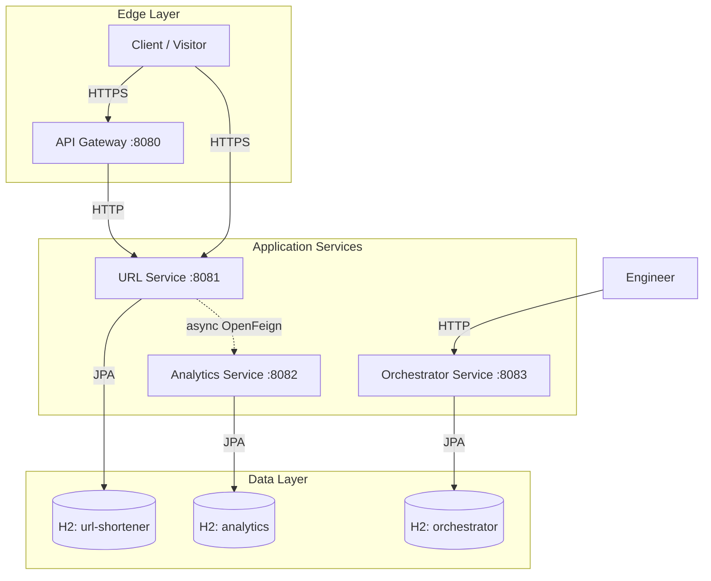

# Engineering Summary

## 1. Project Overview

The URL Shortener Agentic Engineering System is a Java 17 / Spring Boot 3.3 microservice platform built with a Maven multi-module reactor. It provides short-link management, redirect analytics, and an approval-gated SDLC workflow engine. The platform was designed through an agentic engineering process with requirements analysis, architecture design, and implementation milestones, each bounded by human approval gates.

## 2. Technology Stack

| Layer | Technology | Version |
| --- | --- | --- |
| Language | Java | 17 |
| Framework | Spring Boot | 3.3.5 |
| Cloud | Spring Cloud | 2023.0.5 |
| API Documentation | Springdoc OpenAPI | 2.6.0 |
| Inter-service Communication | Spring Cloud OpenFeign | (via Spring Cloud) |
| Circuit Breaker | Resilience4j | (via Spring Cloud) |
| Database | H2 (in-memory) | (via Spring Boot) |
| ORM | Spring Data JPA / Hibernate | (via Spring Boot) |
| Build | Maven | 3.9+ |
| Testing | JUnit 5, Mockito, AssertJ | (via Spring Boot) |
| Logging | Logback | (via Spring Boot) |

## 3. Services Delivered

| Service | Port | Endpoints | Key Classes |
| --- | ---: | ---: | --- |
| API Gateway | 8080 | Health, Swagger | `ApiGatewayApplication`, `GlobalExceptionHandler` |
| URL Service | 8081 | 5 (CRUD + redirect) | `ShortUrlController`, `RedirectController`, `ShortUrlService`, `AnalyticsEventPublisher`, `AnalyticsServiceClient`, `AnalyticsServiceClientFallbackFactory` |
| Analytics Service | 8082 | 4 (ingest + 3 reporting) | `AnalyticsController`, `AnalyticsService`, `ClickAnalyticsRepository` |
| Orchestrator Service | 8083 | 5 (start, get, approve, retry, rollback) | `WorkflowController`, `WorkflowEngine`, `WorkflowStateMachine`, `WorkflowDependencyGraph`, 10 agent classes |

## 4. Final Folder Structure

```text
PSTProject/
├── README.md                                      # Root project README
└── url-shortener/                                 # Maven reactor root
    ├── pom.xml                                    # Parent POM (Spring Boot 3.3.5, Spring Cloud 2023.0.5)
    ├── README.md                                  # Module README
    ├── api-gateway/                               # API Gateway service (port 8080)
    │   ├── pom.xml
    │   └── src/
    │       ├── main/
    │       │   ├── java/com/example/urlshortener/
    │       │   │   ├── ApiGatewayApplication.java
    │       │   │   ├── config/
    │       │   │   │   ├── OpenApiConfiguration.java
    │       │   │   │   └── ValidationConfiguration.java
    │       │   │   └── exception/
    │       │   │       ├── ApiError.java
    │       │   │       └── GlobalExceptionHandler.java
    │       │   └── resources/
    │       │       ├── application.yml
    │       │       └── logback-spring.xml
    │       └── test/
    │           └── java/com/example/urlshortener/
    │               └── ApiGatewayApplicationTests.java
    ├── url-service/                               # URL shortener service (port 8081)
    │   ├── pom.xml
    │   └── src/
    │       ├── main/
    │       │   ├── java/com/example/urlshortener/
    │       │   │   ├── UrlServiceApplication.java
    │       │   │   ├── client/
    │       │   │   │   ├── AnalyticsServiceClient.java
    │       │   │   │   ├── AnalyticsServiceClientFallbackFactory.java
    │       │   │   │   └── AnalyticsServiceException.java
    │       │   │   ├── config/
    │       │   │   │   ├── AnalyticsFeignConfiguration.java
    │       │   │   │   ├── OpenApiConfiguration.java
    │       │   │   │   └── ValidationConfiguration.java
    │       │   │   ├── controller/
    │       │   │   │   ├── RedirectController.java
    │       │   │   │   └── ShortUrlController.java
    │       │   │   ├── dto/
    │       │   │   │   ├── ClickAnalyticsCreateRequest.java
    │       │   │   │   ├── ShortUrlCreateRequest.java
    │       │   │   │   ├── ShortUrlResponse.java
    │       │   │   │   └── ShortUrlUpdateRequest.java
    │       │   │   ├── entity/
    │       │   │   │   └── ShortUrl.java
    │       │   │   ├── exception/
    │       │   │   │   ├── ApiError.java
    │       │   │   │   ├── DuplicateAliasException.java
    │       │   │   │   ├── GlobalExceptionHandler.java
    │       │   │   │   ├── ShortUrlExpiredException.java
    │       │   │   │   ├── ShortUrlInactiveException.java
    │       │   │   │   └── ShortUrlNotFoundException.java
    │       │   │   ├── mapper/
    │       │   │   │   └── ShortUrlMapper.java
    │       │   │   ├── repository/
    │       │   │   │   └── ShortUrlRepository.java
    │       │   │   ├── service/
    │       │   │   │   ├── AnalyticsEventPublisher.java
    │       │   │   │   └── ShortUrlService.java
    │       │   │   └── util/
    │       │   │       └── ShortCodeGenerator.java
    │       │   └── resources/
    │       │       ├── application.yml
    │       │       └── logback-spring.xml
    │       └── test/
    │           └── java/com/example/urlshortener/
    │               ├── UrlServiceApplicationTests.java
    │               ├── client/
    │               │   └── AnalyticsServiceClientFallbackFactoryTest.java
    │               ├── controller/
    │               │   └── RedirectControllerTest.java
    │               ├── repository/
    │               │   └── ShortUrlRepositoryTest.java
    │               └── service/
    │                   ├── AnalyticsEventPublisherTest.java
    │                   └── ShortUrlServiceTest.java
    ├── analytics-service/                         # Analytics service (port 8082)
    │   ├── pom.xml
    │   └── src/
    │       ├── main/
    │       │   ├── java/com/example/urlshortener/
    │       │   │   ├── AnalyticsServiceApplication.java
    │       │   │   ├── config/
    │       │   │   │   ├── OpenApiConfiguration.java
    │       │   │   │   └── ValidationConfiguration.java
    │       │   │   ├── controller/
    │       │   │   │   └── AnalyticsController.java
    │       │   │   ├── dto/
    │       │   │   │   ├── AnalyticsSummaryResponse.java
    │       │   │   │   ├── ClickAnalyticsCreateRequest.java
    │       │   │   │   ├── ClickAnalyticsResponse.java
    │       │   │   │   ├── DailyAnalyticsResponse.java
    │       │   │   │   └── TopAnalyticsResponse.java
    │       │   │   ├── entity/
    │       │   │   │   └── ClickAnalytics.java
    │       │   │   ├── exception/
    │       │   │   │   ├── ApiError.java
    │       │   │   │   └── GlobalExceptionHandler.java
    │       │   │   ├── mapper/
    │       │   │   │   └── ClickAnalyticsMapper.java
    │       │   │   ├── repository/
    │       │   │   │   └── ClickAnalyticsRepository.java
    │       │   │   └── service/
    │       │   │       └── AnalyticsService.java
    │       │   └── resources/
    │       │       ├── application.yml
    │       │       └── logback-spring.xml
    │       └── test/
    │           └── java/com/example/urlshortener/
    │               ├── AnalyticsServiceApplicationTests.java
    │               ├── repository/
    │               │   └── ClickAnalyticsRepositoryTest.java
    │               └── service/
    │                   └── AnalyticsServiceTest.java
    ├── orchestrator-service/                      # Workflow orchestrator (port 8083)
    │   ├── pom.xml
    │   └── src/
    │       ├── main/
    │       │   ├── java/com/example/urlshortener/
    │       │   │   ├── OrchestratorServiceApplication.java
    │       │   │   ├── agent/
    │       │   │   │   ├── ApprovalAgent.java
    │       │   │   │   ├── ArchitectureAgent.java
    │       │   │   │   ├── DocumentationAgent.java
    │       │   │   │   ├── ImplementationAgent.java
    │       │   │   │   ├── PlanningAgent.java
    │       │   │   │   ├── RequirementAgent.java
    │       │   │   │   ├── ReviewerAgent.java
    │       │   │   │   ├── StageAgent.java
    │       │   │   │   ├── TestingAgent.java
    │       │   │   │   └── WorkflowAgent.java
    │       │   │   ├── config/
    │       │   │   │   ├── OpenApiConfiguration.java
    │       │   │   │   └── ValidationConfiguration.java
    │       │   │   ├── controller/
    │       │   │   │   └── WorkflowController.java
    │       │   │   ├── dto/
    │       │   │   │   ├── ApprovalHistoryCreateRequest.java
    │       │   │   │   ├── ApprovalHistoryResponse.java
    │       │   │   │   ├── WorkflowApprovalRequest.java
    │       │   │   │   ├── WorkflowDetailsResponse.java
    │       │   │   │   ├── WorkflowExecutionCreateRequest.java
    │       │   │   │   ├── WorkflowExecutionResponse.java
    │       │   │   │   └── WorkflowStartRequest.java
    │       │   │   ├── entity/
    │       │   │   │   ├── AgentType.java
    │       │   │   │   ├── ApprovalDecision.java
    │       │   │   │   ├── ApprovalHistory.java
    │       │   │   │   ├── DecisionHistory.java
    │       │   │   │   ├── WorkflowAuditEvent.java
    │       │   │   │   ├── WorkflowContextEntry.java
    │       │   │   │   ├── WorkflowExecution.java
    │       │   │   │   ├── WorkflowStage.java
    │       │   │   │   └── WorkflowState.java
    │       │   │   ├── exception/
    │       │   │   │   ├── ApiError.java
    │       │   │   │   ├── GlobalExceptionHandler.java
    │       │   │   │   ├── InvalidWorkflowStateException.java
    │       │   │   │   └── WorkflowNotFoundException.java
    │       │   │   ├── repository/
    │       │   │   │   ├── ApprovalHistoryRepository.java
    │       │   │   │   ├── DecisionHistoryRepository.java
    │       │   │   │   ├── WorkflowAuditEventRepository.java
    │       │   │   │   ├── WorkflowContextRepository.java
    │       │   │   │   └── WorkflowExecutionRepository.java
    │       │   │   ├── service/
    │       │   │   │   ├── WorkflowContextStore.java
    │       │   │   │   └── WorkflowEngine.java
    │       │   │   └── workflow/
    │       │   │       ├── WorkflowDependencyGraph.java
    │       │   │       └── WorkflowStateMachine.java
    │       │   └── resources/
    │       │       ├── application.yml
    │       │       └── logback-spring.xml
    │       └── test/
    │           └── java/com/example/urlshortener/
    │               ├── OrchestratorServiceApplicationTests.java
    │               ├── agent/
    │               │   └── WorkflowAgentsTest.java
    │               ├── repository/
    │               │   ├── ApprovalHistoryRepositoryTest.java
    │               │   └── WorkflowExecutionRepositoryTest.java
    │               └── workflow/
    │                   └── WorkflowDependencyGraphTest.java
    └── docs/                                      # Engineering documentation
        ├── 01-requirement-understanding.md
        ├── Agent-Orchestration.md
        ├── API-Documentation.md
        ├── Architecture.md
        ├── BRD.md
        ├── Engineering-Summary.md
        ├── FRD.md
        ├── Limitations.md
        ├── Production-Readiness-Review.md
        ├── Risk-Analysis.md
        ├── Security-Review.md
        ├── Setup-Guide.md
        ├── Testing-Guide.md
        └── Trade-offs.md
```

## 5. Final Architecture



### Architecture Decisions

| Decision | Choice | Rationale |
| --- | --- | --- |
| Microservice topology | 4 independent services | Separation of concerns; independent deployment and scaling |
| Inter-service communication | Spring Cloud OpenFeign (HTTP) | Declarative client with timeout, retry, circuit breaker, and fallback |
| Analytics delivery | Asynchronous, best-effort | Redirect availability is never compromised by analytics |
| Database | H2 in-memory per service | Zero-infrastructure local development |
| API documentation | Springdoc OpenAPI | Auto-generated Swagger UI from annotations |
| Validation | Bean Validation (Jakarta) | Declarative, composable, framework-integrated |
| Error handling | `@RestControllerAdvice` with shared `ApiError` | Consistent error envelope across all services |
| Workflow engine | State machine + dependency graph + agents | Bounded autonomy with human approval gates |

## 6. Engineering Review Summary

| Area | Rating | Key Finding |
| --- | --- | --- |
| Coding Standards | Partially Ready | Conventions followed; no CI formatting enforcement |
| SOLID | Partially Ready | Good separation; `WorkflowEngine` needs decomposition |
| Exception Handling | Partially Ready | Shared envelope and domain exceptions; no correlation IDs |
| Validation | Partially Ready | Bean validation on all inputs; no auth or rate limits |
| Test Coverage | Not Release-Ready | Unit/JPA tests exist; no coverage gate, integration, or load tests |
| Project Structure | Ready Baseline | Clean Maven reactor with consistent package layout |

## 7. Deliverables Completed

| Deliverable | Status |
| --- | --- |
| README (root + module) | Complete |
| API Documentation | Complete |
| Architecture (with Mermaid diagrams) | Complete |
| Setup Guide | Complete |
| Testing Guide | Complete |
| Production Readiness Review | Complete |
| Trade-offs Analysis | Complete |
| Risk Analysis | Complete |
| Security Review | Complete |
| Limitations | Complete |
| Engineering Summary | Complete |
| BRD | Complete (prior milestone) |
| FRD | Complete (prior milestone) |
| Agent Orchestration Design | Complete (prior milestone) |

## 8. Key Metrics

| Metric | Value |
| --- | --- |
| Services | 4 |
| Total Java source files | ~60 |
| Total test files | 15 |
| API endpoints | 14 (5 URL + 4 Analytics + 5 Orchestrator) |
| Documentation files | 14 |
| Maven modules | 4 + 1 parent |
| Spring Boot version | 3.3.5 |
| Java version | 17 |

## 9. Production Readiness Verdict

**Not production-ready.** The platform is a production-oriented engineering baseline. The following are mandatory before release:

1. Migrate from H2 to PostgreSQL with migrations and backups
2. Implement OIDC/JWT authentication and RBAC authorization
3. Terminate TLS at edge; configure mTLS for inter-service
4. Add rate limiting on all endpoints
5. Add URL safety policy (blocklist, reserved words)
6. Implement secret management
7. Add IP/referrer privacy controls and retention policy
8. Add CI pipeline with quality gates, coverage, and dependency scanning
9. Add Micrometer metrics, correlation IDs, and distributed tracing
10. Conduct load, soak, and failure-injection tests with defined SLOs
11. Add audit trail for all management operations
12. Implement transactional outbox for guaranteed analytics delivery

## 10. Conclusion

The URL Shortener Agentic Engineering System delivers a coherent, well-structured microservice baseline with short URL lifecycle management, best-effort redirect analytics, and an approval-gated SDLC workflow engine. The codebase follows Java/Spring conventions, applies Bean Validation consistently, uses a shared error envelope, and includes unit and JPA tests across all services. The architecture documentation, BRD, FRD, and agent orchestration design provide a comprehensive blueprint for production development. The identified security, persistence, observability, and testing gaps are documented with clear mitigations and release gates.