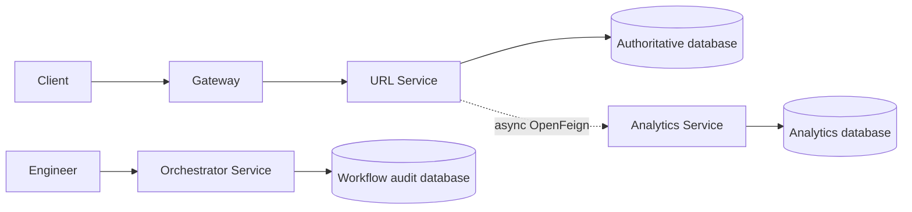
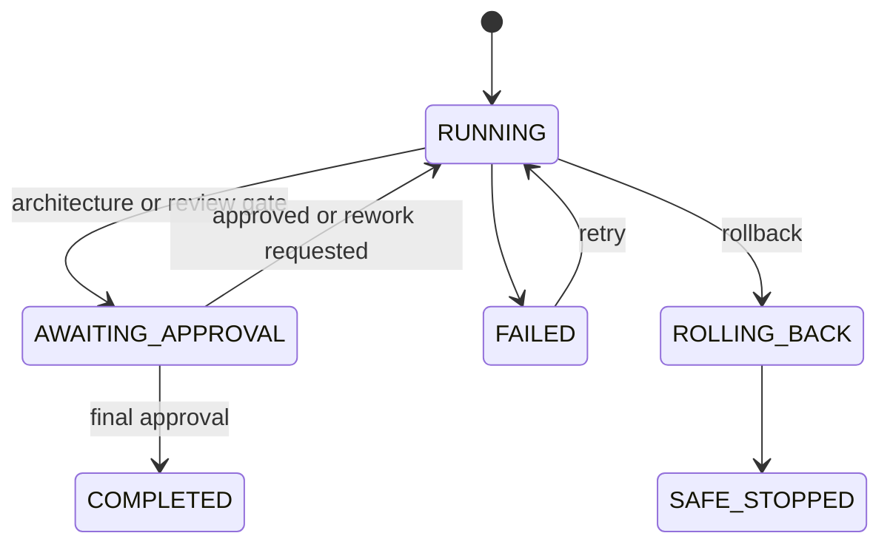

# Production Readiness Review

## Final Architecture

## Engineering Review

| Area | Assessment | Evidence / Required Follow-up |
| --- | --- | --- |
| Coding standards | Partially ready | Java/Spring conventions, DTO validation, package layering, and focused tests exist. Apply formatting and static analysis in CI. |
| SOLID | Partially ready | Controllers delegate to services; Feign client/fallback and workflow agents separate concerns. Some workflow classes should be decomposed as behavior grows. |
| Exception handling | Partially ready | Shared error envelope and domain exceptions exist. Add correlation IDs and error metrics. |
| Validation | Partially ready | Bean validation is applied to request DTOs and path/query inputs. Add authorization and request-size limits. |
| Test coverage | Not release-ready | Unit/JPA tests exist, but no measured threshold, contract, load, or production dependency tests. |
| Project structure | Ready baseline | Maven reactor cleanly separates URL, analytics, orchestrator, and gateway services. |

## Trade-offs

- OpenFeign asynchronous delivery prioritizes redirect availability over guaranteed analytics delivery; events may be lost after retries and fallback.
- H2 keeps local setup simple but provides no production durability, backup, or multi-instance guarantees.
- The orchestrator records workflow state locally but does not execute isolated remote agents or provide durable work queues.
- In-process retry/circuit breaking reduces dependency impact but needs metrics and tuned values under load.

## Security Review

Current controls include DTO validation, constrained short-code formats, non-sensitive error responses, and externalized service URL configuration. Release blockers are authentication and authorization, API-gateway routing policy, secret management, TLS/mTLS policy, database encryption and backups, rate limiting, audit access control, privacy/retention policy for IP and referrer data, dependency scanning, and security testing.

## Risk Analysis

| Risk | Impact | Mitigation before production |
| --- | --- | --- |
| Analytics event loss | Incomplete reporting | Durable outbox or queue, delivery metrics, replay policy. |
| H2 data loss | Lost links/audit history | PostgreSQL, migrations, backups, restore tests. |
| Unprotected APIs | Unauthorized changes/data exposure | OIDC/JWT authentication, RBAC, gateway enforcement. |
| Redirect abuse | Reputation/security harm | Strict URL policy, rate limits, abuse monitoring. |
| No load evidence | Latency/availability regression | Load, soak, and failure-injection tests with SLOs. |

## Limitations and Release Gates

Do not release until durable storage, schema migrations, authentication/authorization, gateway routing, secrets management, structured metrics/tracing, backup/restore, security review, privacy approval, CI quality gates, and load/resilience evidence are complete. The current implementation is suitable for local development and controlled engineering demonstration only.

## Final Engineering Summary

The platform now provides short URL lifecycle and redirect behavior, best-effort analytics capture and reporting, and an approval-gated SDLC workflow engine. The codebase has a coherent service structure and baseline validation/error handling. Production readiness is intentionally incomplete: the missing security, persistence, operational, and verification controls above are mandatory release work.
