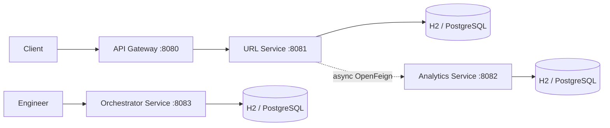
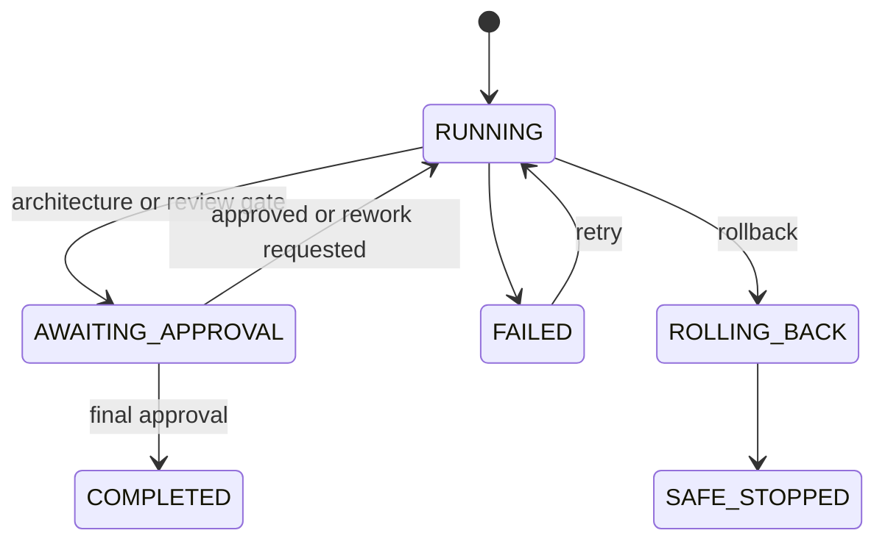

# Production Readiness Review

## Final Architecture

### Implemented Topology

The platform is a Maven multi-module reactor with four independently deployable Spring Boot services. Each service has its own in-memory H2 database, its own OpenAPI/Swagger UI, its own actuator health endpoint, and its own structured logging via Logback. URL Service communicates with Analytics Service through Spring Cloud OpenFeign with a circuit breaker, bounded retry, and a fallback factory that logs undelivered events without affecting the redirect response.

## Engineering Review

### Verification Summary

| Area | Assessment | Evidence / Required Follow-up |
| --- | --- | --- |
| Coding standards | Partially ready | Java/Spring conventions, DTO validation, package layering, and focused tests exist. Apply formatting and static analysis in CI. |
| SOLID | Partially ready | Controllers delegate to services; Feign client/fallback and workflow agents separate concerns. Some workflow classes should be decomposed as behavior grows. |
| Exception handling | Partially ready | Shared error envelope and domain exceptions exist. Add correlation IDs and error metrics. |
| Validation | Partially ready | Bean validation is applied to request DTOs and path/query inputs. Add authorization and request-size limits. |
| Test coverage | Not release-ready | Unit/JPA tests exist, but no measured threshold, contract, load, or production dependency tests. |
| Project structure | Ready baseline | Maven reactor cleanly separates URL, analytics, orchestrator, and gateway services. |

### Coding Standards — Detailed Findings

- **Naming:** Classes, methods, and packages follow Java conventions. Records are used for DTOs and error envelopes.
- **Layering:** Each service follows `controller → service → repository` with `dto`, `entity`, `exception`, `mapper`, `config`, and `util` packages. Placeholder `.gitkeep` directories reserve future packages (`common`, `mapper`, `validation`).
- **Formatting:** No formatter or static analysis tool is configured in CI. The orchestrator service has several compressed single-line method bodies that reduce readability.
- **Recommendation:** Add `spotless-maven-plugin` or `checkstyle` and enforce in CI.

### SOLID — Detailed Findings

- **Single Responsibility:** `ShortUrlService` handles CRUD and resolution; `AnalyticsEventPublisher` handles async delivery; `AnalyticsServiceClientFallbackFactory` handles fallback. `WorkflowEngine` is a large class that combines state management, agent dispatch, audit recording, and response mapping — it should be decomposed as behavior grows.
- **Open/Closed:** `WorkflowAgent` interface with `AgentType` mapping allows new agents without modifying the engine. Feign client interface allows configuration changes without code changes.
- **Liskov Substitution:** Fallback factory returns a valid `AnalyticsServiceClient` implementation. All agent implementations satisfy the `WorkflowAgent` contract.
- **Interface Segregation:** Feign client exposes only `recordClick`. Repository interfaces expose only needed query methods.
- **Dependency Inversion:** Controllers depend on service abstractions (concrete classes, not interfaces — a future improvement). Services depend on repository interfaces. `Clock` is injected for testable time.
- **Recommendation:** Extract service interfaces for `ShortUrlService` and `AnalyticsService` to fully invert dependencies.

### Exception Handling — Detailed Findings

- **Domain exceptions:** `ShortUrlNotFoundException`, `DuplicateAliasException`, `ShortUrlInactiveException`, `ShortUrlExpiredException`, `WorkflowNotFoundException`, `InvalidWorkflowStateException`.
- **Global handlers:** Each service has a `GlobalExceptionHandler` with `@RestControllerAdvice` that maps domain exceptions to HTTP status codes and returns a shared `ApiError` envelope.
- **Catch-all:** An `Exception` catch-all handler returns `500` with a generic message and logs the full exception.
- **Gaps:** No correlation IDs are propagated or returned. No error metrics are emitted. No request-level timeout or circuit breaker on the redirect path.
- **Recommendation:** Add a correlation ID filter, Micrometer error counters, and structured error logging.

### Validation — Detailed Findings

- **Bean Validation:** `@Valid` on request bodies, `@Validated` on controllers, `@Pattern` on path variables, `@Min`/`@Max` on query parameters. Entity-level constraints on `ShortUrl` and `ClickAnalytics`.
- **URL validation:** `@URL(protocol = "https")` enforces HTTPS-only destinations.
- **Alias validation:** `@Pattern(^[A-Za-z0-9_-]{3,32}$)` on custom aliases and short codes.
- **Gaps:** No reserved-word filtering, no URL blocklist, no request size limits, no rate limiting, no authorization checks.
- **Recommendation:** Add a URL safety policy, reserved-word list, request size limits, and rate limiting.

### Test Coverage — Detailed Findings

| Module | Test Classes | Coverage Scope |
| --- | --- | --- |
| url-service | `ShortUrlServiceTest`, `RedirectControllerTest`, `ShortUrlRepositoryTest`, `AnalyticsEventPublisherTest`, `AnalyticsServiceClientFallbackFactoryTest`, `UrlServiceApplicationTests` | Service logic, redirect delegation, JPA repository, fallback behavior, context load. |
| analytics-service | `AnalyticsServiceTest`, `ClickAnalyticsRepositoryTest`, `AnalyticsServiceApplicationTests` | Aggregation logic, JPA repository, context load. |
| orchestrator-service | `WorkflowAgentsTest`, `WorkflowDependencyGraphTest`, `WorkflowExecutionRepositoryTest`, `ApprovalHistoryRepositoryTest`, `OrchestratorServiceApplicationTests` | Agent types, dependency graph, JPA repositories, context load. |
| api-gateway | `ApiGatewayApplicationTests` | Context load only. |

- **Gaps:** No coverage threshold enforced. No integration tests against production databases. No contract tests for the URL-to-Analytics Feign call. No load, soak, or failure-injection tests. No end-to-end redirect tests.
- **Recommendation:** Add JaCoCo with a minimum coverage gate, Testcontainers integration tests, Spring Cloud Contract tests, and k6/Gatling load tests.

### Project Structure — Detailed Findings

- **Maven reactor:** Parent POM manages Spring Boot 3.3.5, Spring Cloud 2023.0.5, and Springdoc 2.6.0. Four modules with consistent structure.
- **Package structure:** `com.example.urlshortener` with `controller`, `service`, `repository`, `entity`, `dto`, `exception`, `mapper`, `config`, `util`, `client`, `agent`, `workflow` packages.
- **Consistency:** All services follow the same package layout. Placeholder `.gitkeep` files maintain empty package directories.
- **Assessment:** The structure is a clean, extensible baseline suitable for production development.

## Trade-offs

- OpenFeign asynchronous delivery prioritizes redirect availability over guaranteed analytics delivery; events may be lost after retries and fallback.
- H2 keeps local setup simple but provides no production durability, backup, or multi-instance guarantees.
- The orchestrator records workflow state locally but does not execute isolated remote agents or provide durable work queues.
- In-process retry/circuit breaking reduces dependency impact but needs metrics and tuned values under load.
- Synchronous JPA operations simplify transactional correctness but do not yet leverage caching (Redis) or asynchronous messaging (Kafka) described in the target architecture.

## Security Review

Current controls include DTO validation, constrained short-code formats, non-sensitive error responses, and externalized service URL configuration. Release blockers are authentication and authorization, API-gateway routing policy, secret management, TLS/mTLS policy, database encryption and backups, rate limiting, audit access control, privacy/retention policy for IP and referrer data, dependency scanning, and security testing.

## Risk Analysis

| Risk | Impact | Mitigation before production |
| --- | --- | --- |
| Analytics event loss | Incomplete reporting | Durable outbox or queue, delivery metrics, replay policy. |
| H2 data loss | Lost links/audit history | PostgreSQL, migrations, backups, restore tests. |
| Unprotected APIs | Unauthorized changes/data exposure | OIDC/JWT authentication, RBAC, gateway enforcement. |
| Redirect abuse | Reputation/security harm | Strict URL policy, rate limits, abuse monitoring. |
| No load evidence | Latency/availability regression | Load, soak, and failure-injection tests with SLOs. |
| No correlation IDs | Untraceable failures | Correlation ID filter, structured logging, tracing. |
| No rate limiting | Abuse and resource exhaustion | Edge or application rate limits on creation and redirect. |
| IP/referrer privacy exposure | Compliance violation | Data minimization, retention policy, PII classification. |

## Limitations and Release Gates

Do not release until durable storage, schema migrations, authentication/authorization, gateway routing, secrets management, structured metrics/tracing, backup/restore, security review, privacy approval, CI quality gates, and load/resilience evidence are complete. The current implementation is suitable for local development and controlled engineering demonstration only.

## Final Engineering Summary

The platform now provides short URL lifecycle and redirect behavior, best-effort analytics capture and reporting, and an approval-gated SDLC workflow engine. The codebase has a coherent service structure and baseline validation/error handling. Production readiness is intentionally incomplete: the missing security, persistence, operational, and verification controls above are mandatory release work.